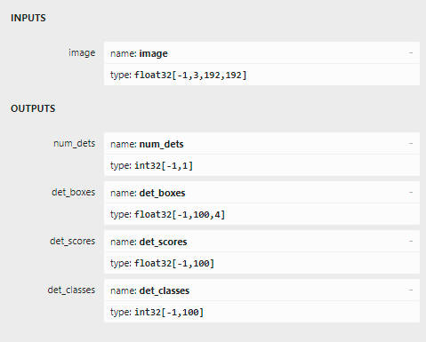

## PP-PicoDet 和 PP-YOLOE
模型导出参考[end2end_ppyoloe](https://github.com/PaddlePaddle/PaddleDetection/tree/develop/deploy/end2end_ppyoloe)
### 模型下载
    paddle原始模型及转换后的onnx模型下载地址如下
## 模型转换
1. 依赖的环境
    ``` bash
    git clone https://github.com/PaddlePaddle/PaddleDetection.git -b develop
   # 切换到develop分支
    pip install onnx
    pip install paddle2onnx
    pip install onnx-simplifier
    pip install onnx-graphsurgeon --index-url https://pypi.ngc.nvidia.com
    ```
2. paddle原始模型转inference模型
   - 对于 PicoDet 模型
    ``` bash
    cd PaddleDetection
    python tools/export_model.py 
        -c configs/picodet/picodet_xs_320_coco_lcnet.yml 
        -o weights=picodet_xs_320_coco_lcnet.pdparams 
        export.nms=False --output_dir=output_inference
    ```
    - 对于 YOLOE 模型
    ``` bash
    python ./tools/export_model.py \
        -c configs/ppyoloe/ppyoloe_crn_s_300e_coco.yml \
        -o weights=ppyoloe_crn_s_300e_coco.pdparams \
        trt=True \
        exclude_nms=True \
        --output_dir ./output_inference/
    ```

3. 转onnx
   
    ``` bash
    python ./deploy/export_onnx.py --model-dir output_inference/picodet_s_192_lcnet_pedestrian --save-file output_inference/picodet_s_192_lcnet_pedestrian.onnx --opset 11 --batch-size -1 --topk-all 100 --iou-thres 0.5 --conf-thres 0.2 
    --is-pico 
    --trt-nms
    ```
    - `--is_pico` 参数指定是否为Pico模型
    - `--trt-nms` 指定是否添加trt nms插件， 推荐为不添加


4. onnxruntime 和tensorrt 推理
   ``` bash
    trtexec \
    --onnx=ppyoloe_crn_s_300e_coco.onnx \
    --saveEngine=ppyoloe_crn_s_300e_coco.engine \
    --fp16
   ```
   ``` bash
    # if use cuda-python infer, please install it
    pip install cuda-python
    # if use cupy infer, please install it
    pip install cupy-cuda117 # cuda110-cuda117 are all available

    cd deploy 
    python predict_onnxruntime.py onnx_path image_path

   ```


